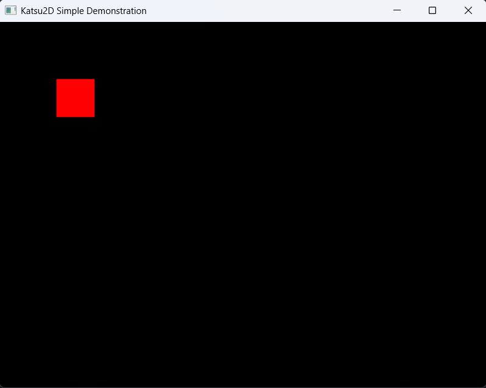

# Katsu2D (カツ2D)

Unleash your game ideas with this high-performance game framework built in Go, leveraging the power of Ebitengine. This framework features a fast and unique Entity Component System (ECS) architecture, an optimized batching renderer with support for position, rotation, and scaling, and a simplified API designed for both power and ease of use.

## 🚧 WORK IN PROGRESS 🚧

This project is currently under active development. While core functionalities are in place and demonstrate high performance, the API and internal structures may undergo significant changes. It is not yet recommended for production use.

**Your feedback and contributions are highly welcome!** If you encounter issues, have suggestions, or wish to contribute, please feel free to do so.

## Features

- **Fast & Unique ECS Architecture:** A robust Entity Component System that promotes modularity, reusability, and high performance by separating data (components) from logic (systems).
- **Optimized Batching Renderer:** Efficiently draws multiple sprites in a single draw call, significantly reducing overhead. Supports advanced transformations like rotation and scaling for batched entities.
- **Smooth Slow Motion Control:** Implement dynamic time scaling with smooth interpolation (lerping) between normal and slow-motion speeds, allowing for compelling gameplay effects.
- **Flexible Cooldown System:** Easily manage ability cooldowns or timed events with a dedicated component and system.
- **Simplified API with Functional Options:** A fluent, chainable API for engine configuration and entity creation, inspired by the "Functional Options" pattern, making setup and game logic development more intuitive.
- **Modular and Extensible:** Designed with clear separation of concerns, making it easy to add new components, systems, or features.

## Getting Started

The engine is designed to be highly configurable and easy to use through its engine.NewEngine constructor and functional options.

### Prerequisites

- Go 1.21 or higher
- [Ebitengine](https://ebitengine.org) v2.8.8 (or compatible version)

### Installation

```cmd
go get github.com/edwinsyarief/katsu2d
```

### Usage example

```go
package main

import (
	"image/color"

	ebimath "github.com/edwinsyarief/ebi-math"
	"github.com/edwinsyarief/katsu2d"
	"github.com/hajimehoshi/ebiten/v2"
)

func main() {
	// Initialize engine
	game := katsu2d.NewEngine(
		katsu2d.WithWindowSize(640, 480),
		katsu2d.WithWindowTitle("Katsu2D Simple Demonstration"),
		katsu2d.WithWindowResizeMode(ebiten.WindowResizingModeEnabled),
		katsu2d.WithClearScreenEachFrame(false),
	)

	// Register built-in system
	game.AddSystem(
		katsu2d.NewRenderSystem(game.TextureManager()),
	)

	// Create a new entity
	e := game.World().NewEntity()

	// Create a transform component
	t := katsu2d.NewTransform()
	t.SetPosition(ebimath.V(100, 100))

	// Create a sprite component
	s := katsu2d.NewSprite(0, 50, 50)
	s.Color = color.RGBA{R: 255, G: 0, B: 0, A: 255}

	// Add components into entity
	game.World().AddComponent(e, t)
	game.World().AddComponent(e, s)

	if err := game.Run(); err != nil {
		panic(err)
	}
}
```

#### Screenshot



Here is the example repo: [https://github.com/edwinsyarief/katsu2d-simple-demo](https://github.com/edwinsyarief/katsu2d-simple-demo)

### Functional options

The `katsu2d.NewEngine` function accepts various Option functions to configure the engine:

- `katsu2d.WithWindowSize(int, int)`: Overrides the default window dimensions.
- `katsu2d.WithWindowTitle(string)`: Overrides the default window title.
- `katsu2d.WithWindowsResizeMode(ebiten.WindowResizingModeType)`: Overrides the default windows resizing mode.
- `katsu2d.WithFullScreen(bool)`: Overrides the default windows fullscreen mode.
- `katsu2d.WithVsyncEnabled(bool)`: Overrides the default vsync mode.
- `katsu2d.WithCursorMode(ebiten.CursorModeType)`: Overrides the default cursor mode.
- `katsu2d.WithClearScreenEachFrame(bool)`: Overrides the default clear screen every frame.

### Working with Entities and Components

TODO

## Why Katsu2D?

The name **Katsu2D** draws a playful and fitting analogy to the beloved Japanese dish (カツ), often a perfectly breaded and fried cutlet.

Just as a great katsu is known for its:

- **Crispy, High-Performance Exterior:** The framework aims for **blazing fast performance** and a **sharp, responsive feel** in your 2D games, much like the satisfying crunch of a well-fried panko crust.
- **Tender, Robust Interior:** Beneath the surface, Katsu2D offers a **robust and reliable ECS core**, providing a solid foundation for complex game logic and interactions, akin to the tender, flavorful meat within.
- **Simple, Satisfying Experience:** The goal is to provide a **streamlined and enjoyable development experience**, allowing you to focus on the creative aspects of your game without getting bogged down in boilerplate, just as a perfectly prepared katsu offers a simple yet deeply satisfying meal.

Combined with "2D" to clearly define its domain, **Katsu2D** signifies a framework designed to help you create games that are both **performant and a pleasure to build and play**.

## License

This project is licensed under the MIT License. See the [LICENSE](./LICENSE) file for details.
